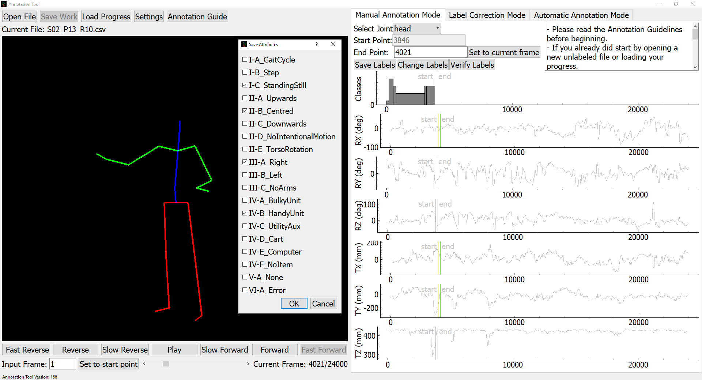
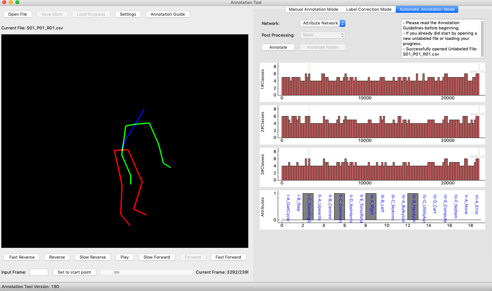

# Logistic Activity Recognition Challenge (LARa) 
Implementation code for the Annotation Tool that is used for LARa dataset, presented in the Journal "LARa: Creating a Dataset for Human Activity Recognition in Logistics Using Semantic Attributes", see https://www.mdpi.com/1424-8220/20/15/4083

And

# ICPR20:From Human Pose to On Body Devices for Human Activity Recognition
Implementation code for "From Human Pose to On Body Devices for Human Activity Recognition, see https://ieeexplore.ieee.org/document/9412283

## Prerequisites
The implementation is done in Python 3.7:

-numpy

-scipy

-scikit-learn

-PyQt5

-pygtgraph

-pytorch

-PyOpenGL

-dill

## Dataset

LARa dataset can be downloaded in https://zenodo.org/record/3862782#.XtVJOy9h3UI

## Example

Running the `main.py` script in Annotation_Tool_LARa. 
- For using the tCNNs for predicting activities classes, download the 'class_network.pt' and 'attr_network.pt' from LARa dataset. 
- Store the networks 'class_network.pt' and 'attr_network.pt' in Annotation_Tool_LARa/networks/
  Annotation_Tool_LARa/networks/class_network.pt
  Annotation_Tool_LARa/networks/attr_network.pt
  

## Contact

  - Erik Altermann        erik.altermann@tu-dortmund.de
  - Fernando Moya Rueda   fernando.moya@tu-dortmund.de
  
Technische University of Dortmund
Department of Computer Science
Dortmund, Germany
  
  
The work on this publication was supported by Deutsche Forschungsgemeinschaft (DFG) in the context of the project Fi799/10-2, HO2403/14-2 ''Transfer Learning for Human Activity Recognition in Logistics''.

# Annotation_Tool_LARa
Annotation_Tool_LARa

